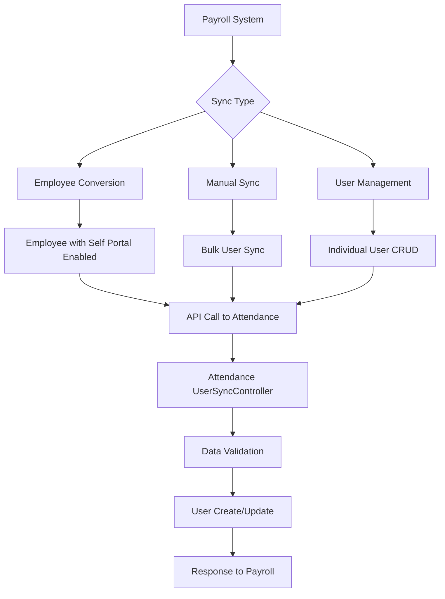

# User Synchronization Documentation

## Overview

The HRMS system implements a sophisticated user synchronization mechanism between two modules:
- **Payroll Module**: Primary user and employee management
- **Attendance Module**: Secondary system that receives synchronized user data

This document explains the complete user sync process, including both automatic and manual synchronization methods.

---

## Table of Contents

1. [System Architecture](#system-architecture)
2. [Data Flow](#data-flow)
3. [Sync Types](#sync-types)
4. [Implementation Details](#implementation-details)
5. [API Endpoints](#api-endpoints)
6. [Configuration](#configuration)
7. [Troubleshooting](#troubleshooting)

---

## System Architecture

### Database Structure

#### Payroll System (Primary)
- **users table**: Contains user accounts with authentication data
  - `id`: Primary key (maps to `payroll_user_id` in attendance)
  - `user_id`: Unique identifier (e.g., "DRI-002")
  - `employee_id`: Links to employee data (maps to `payroll_id` in attendance)
  - `name`, `email`, `password`: User credentials
  - `role_name`, `status`, `department`, `position`: User attributes

- **employee_basic_details table**: Contains employee information
  - `id`: Primary key
  - `employee_id`: Employee identifier
  - `enable_self_portal`: Boolean flag for user account creation

#### Attendance System (Secondary)
- **users table**: Receives synchronized user data
  - `id`: Primary key
  - `employee_id`: Maps to `user_id` from payroll
  - `payroll_id`: Maps to `employee_id` from payroll users table
  - `payroll_user_id`: Maps to `id` from payroll users table
  - `name`, `email`, `password`: Synchronized user data
  - `role`, `designation`, `department_id`: Mapped attributes

### ID Mapping
```
Payroll → Attendance Mapping:
- payroll.users.user_id → attendance.users.employee_id
- payroll.users.employee_id → attendance.users.payroll_id
- payroll.users.id → attendance.users.payroll_user_id
```

---

## Data Flow



---

## Sync Types

### 1. Employee Conversion Sync (Automatic)

**Trigger**: When an employee is created/updated with `enable_self_portal = true` and has an email address.

**Process**:
1. Employee data is saved in `employee_basic_details`
2. System automatically creates user account in `users` table
3. `syncNewUserWithAttendance()` method is called
4. User data is sent to attendance system via API

**Files Involved**:
- `payroll/app/Http/Controllers/EmployeeController.php`
- `payroll/app/Http/Controllers/UserManagementController.php`

**Code Flow**:
```php
// In EmployeeController.php
if (!empty($basic->email) && $basic->enable_self_portal) {
    $user = \App\Models\User::createFromEmployee($basic);
    $this->syncNewUserWithAttendance($user, $defaultPassword);
}
```

### 2. Manual Sync (Bulk)

**Trigger**: Admin manually initiates sync via web interface or API.

**Access**: `/users/sync` route in payroll system

**Process**:
1. Admin clicks "Sync All Users" button
2. System retrieves all users with `employee_id`
3. Each user is sent to attendance system
4. Success/failure status is reported

**Files Involved**:
- `payroll/app/Http/Controllers/UserSyncController.php`
- `payroll/resources/views/sync/users.blade.php`

**Methods**:
- `syncAll()`: Web interface sync
- `executeSyncUsers()`: AJAX/API sync
- `syncIndividualUser()`: Single user sync

### 3. User Management Sync (Automatic)

**Trigger**: When users are created, updated, or deleted through user management interface.

**Process**:
1. User CRUD operation in payroll system
2. Automatic sync call to attendance system
3. Real-time synchronization of changes

**Files Involved**:
- `payroll/app/Http/Controllers/UserManagementController.php`

**Operations**:
- Create: `addNewUserSaveWithSync()`
- Update: User profile updates with sync
- Delete: User deletion with sync
- Password: Password changes with sync

---

## Implementation Details

### Payroll System Implementation

#### UserSyncController.php
```php
// Manual sync method
public function syncAll(Request $request)
{
    $users = User::whereNotNull('employee_id')->get();
    
    foreach ($users as $user) {
        $userData = [
            'user_id' => $user->user_id,
            'payroll_id' => (string) $user->employee_id,
            'payroll_user_id' => $user->id,
            'name' => $user->name,
            'email' => $user->email,
            'role_name' => $user->role_name,
            'status' => $user->status,
            'department' => $user->department,
            'designation' => $user->position,
            'phone' => $user->phone_number,
            'password' => $user->password,
        ];
        
        // Send to attendance API
        $response = Http::withHeaders($headers)
            ->put("$apiUrl/users/{$user->user_id}/sync-simple", $userData);
    }
}
```

#### EmployeeController.php
```php
// Automatic sync when employee converts to user
private function syncNewUserWithAttendance($user, $plainPassword)
{
    $syncData = [
        'user_id' => $user->user_id,
        'payroll_id' => (string) $user->employee_id,
        'payroll_user_id' => $user->id,
        'name' => $user->name,
        'email' => $user->email,
        'role_name' => $user->role_name ?? 'Employee',
        // ... other fields
    ];
    
    $userController = new UserManagementController();
    $syncResult = $userController->syncUserWithAttendance($syncData, 'create');
}
```

### Attendance System Implementation

#### UserSyncController.php
```php
// Handle incoming sync requests
private function handleUserSync(Request $request, $action, $id = null)
{
    // Validation
    $validator = Validator::make($request->all(), [
        'user_id' => 'required|string',
        'payroll_id' => 'nullable|string',
        'payroll_user_id' => 'nullable|integer',
        'name' => 'required|string|max:255',
        'email' => 'required|email|max:255',
        // ... other validation rules
    ]);
    
    if ($action === 'create') {
        $existingUser = User::where('employee_id', $userData['user_id'])
                          ->orWhere('email', $userData['email'])
                          ->orWhere('payroll_id', $userData['payroll_id'])
                          ->orWhere('payroll_user_id', $userData['payroll_user_id'])
                          ->first();
        
        if ($existingUser) {
            $user = $this->updateUserData($existingUser, $userData);
        } else {
            $user = $this->createNewUser($userData);
        }
    }
}

// Create new user
private function createNewUser($userData)
{
    return User::create([
        'employee_id' => $userData['user_id'],
        'payroll_id' => $userData['payroll_id'] ?? null,
        'payroll_user_id' => $userData['payroll_user_id'] ?? null,
        'name' => $userData['name'],
        'email' => $userData['email'],
        'password' => $this->handlePassword($userData['password'] ?? 'attendance123'),
        'role' => $this->mapRoleFromOld($userData['role_name'] ?? 'Employee'),
        // ... other fields
    ]);
}
```

---

## API Endpoints

### Payroll System (Client)

| Method | Endpoint | Purpose |
|--------|----------|---------|
| GET | `/users/sync` | Sync dashboard |
| GET | `/users/sync/all` | Manual sync all users |
| POST | `/users/sync/execute` | AJAX sync execution |
| POST | `/users/sync/individual` | Sync single user |

### Attendance System (Server)

| Method | Endpoint | Purpose |
|--------|----------|---------|
| POST | `/api/users/verify-token` | Token verification |
| POST | `/api/users/sync-simple` | Create user |
| PUT | `/api/users/{user_id}/sync-simple` | Update user |
| DELETE | `/api/users/{user_id}/sync-simple` | Delete user |
| POST | `/api/users/{user_id}/password` | Sync password |

---

## Configuration

### Environment Variables

#### Payroll System (.env)
```env
ATTENDANCE_API_BASE_URL=https://attendancedev.isarva.in/api
ATTENDANCE_API_TOKEN=hrms_sync_token_2025_secure_key
ATTENDANCE_SYNC_ENABLED=true
```

#### Attendance System (.env)
```env
ATTENDANCE_API_TOKEN=hrms_sync_token_2025_secure_key
```

### Routes Configuration

#### Payroll Routes
```php
// web.php
Route::controller(UserSyncController::class)->group(function () {
    Route::middleware('auth')->group(function () {
        Route::get('users/sync', 'index')->name('users.sync');
        Route::get('users/sync/all', 'syncAllUsers')->name('users.sync.all');
        Route::post('users/sync/execute', 'executeSyncUsers')->name('users.sync.execute');
        Route::post('users/sync/individual', 'syncIndividualUser')->name('users.sync.individual');
    });
});
```

#### Attendance Routes
```php
// api.php
Route::prefix('api')->group(function () {
    Route::post('/users/sync-simple', [UserSyncController::class, 'syncUserFromPayroll']);
    Route::put('/users/{user_id}/sync-simple', [UserSyncController::class, 'updateUserFromPayroll']);
    Route::delete('/users/{user_id}/sync-simple', [UserSyncController::class, 'deleteUserFromPayroll']);
    Route::post('/users/{user_id}/password', [UserSyncController::class, 'syncPasswordFromPayroll']);
});
```

---

## Data Sync Examples

### Example 1: Employee Conversion
```json
{
  "trigger": "Employee created with self-portal enabled",
  "payroll_data": {
    "employee_id": "EMP001",
    "name": "John Doe",
    "email": "john@example.com",
    "enable_self_portal": true
  },
  "user_creation": {
    "user_id": "DRI-001",
    "employee_id": 1,
    "name": "John Doe",
    "email": "john@example.com"
  },
  "sync_payload": {
    "user_id": "DRI-001",
    "payroll_id": "1",
    "payroll_user_id": 25,
    "name": "John Doe",
    "email": "john@example.com",
    "role_name": "Employee"
  }
}
```

### Example 2: Manual Sync
```json
{
  "trigger": "Admin clicks 'Sync All Users'",
  "users_found": 15,
  "sync_results": {
    "successful": 14,
    "failed": 1,
    "errors": [
      {
        "user": "Jane Smith",
        "error": "Email already exists"
      }
    ]
  }
}
```

---

## Troubleshooting

### Common Issues

#### 1. Sync Token Issues
**Problem**: 401 Unauthorized responses
**Solution**: 
- Verify `ATTENDANCE_API_TOKEN` matches in both systems
- Check token format in Authorization header

#### 2. Missing IDs
**Problem**: `payroll_id` or `payroll_user_id` are null
**Solution**:
- Ensure user has `employee_id` in payroll system
- Verify sync payload includes both ID fields

#### 3. Validation Errors
**Problem**: 422 Validation failed responses
**Solution**:
- Check data types (payroll_id as string, payroll_user_id as integer)
- Verify required fields are present

#### 4. User Not Found Errors
**Problem**: 404 errors during updates
**Solution**:
- Check if user exists in attendance system
- Verify ID mapping is correct

### Debug Commands

#### Check Sync Configuration
```bash
cd /home/hrmsdev.isarva.in/public_html/payroll
php artisan tinker --execute="
echo 'API URL: ' . env('ATTENDANCE_API_BASE_URL') . PHP_EOL;
echo 'Sync Enabled: ' . (env('ATTENDANCE_SYNC_ENABLED') ? 'Yes' : 'No') . PHP_EOL;
"
```

#### Verify User Data
```bash
cd /home/hrmsdev.isarva.in/public_html/payroll
php artisan tinker --execute="
\$user = \App\Models\User::whereNotNull('employee_id')->first();
echo 'User ID: ' . \$user->id . ', Employee ID: ' . \$user->employee_id . PHP_EOL;
"
```

#### Check Attendance System
```bash
cd /home/hrmsdev.isarva.in/public_html/attendance
php artisan tinker --execute="
\$user = \App\Models\User::whereNotNull('payroll_id')->first();
echo 'Payroll ID: ' . \$user->payroll_id . ', Payroll User ID: ' . \$user->payroll_user_id . PHP_EOL;
"
```

---

## Security Considerations

1. **API Token Security**: Use strong, unique tokens for sync authentication
2. **HTTPS Only**: All sync communications must use HTTPS
3. **Data Validation**: Strict validation on both sending and receiving ends
4. **Access Control**: Sync endpoints require proper authentication
5. **Audit Logging**: All sync operations are logged for audit trails

---

## Performance Considerations

1. **Batch Processing**: Manual sync processes users in batches
2. **Timeout Settings**: API calls have reasonable timeout limits
3. **Error Handling**: Failed syncs don't block other operations
4. **Background Processing**: Consider queue-based sync for large datasets

---

## Monitoring and Logs

### Log Locations
- Payroll: `storage/logs/laravel.log`
- Attendance: `storage/logs/laravel.log`

### Log Examples
```
[2025-10-13 12:40:43] INFO: User synced successfully with attendance
[2025-10-13 12:40:44] WARNING: Failed to sync user with attendance: User not found
[2025-10-13 12:40:45] ERROR: Password sync failed: Connection timeout
```

---

## Conclusion

The user synchronization system provides robust, real-time data consistency between the payroll and attendance modules. It supports both automatic synchronization (when employees are converted to users) and manual synchronization (bulk operations), ensuring data integrity across both systems.

For technical support or additional configuration, refer to the individual controller files and their respective documentation.

---

**Last Updated**: October 13, 2025  
**Version**: 1.0  
**Authors**: Development Team